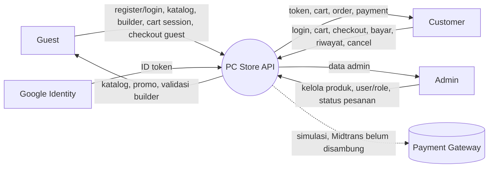
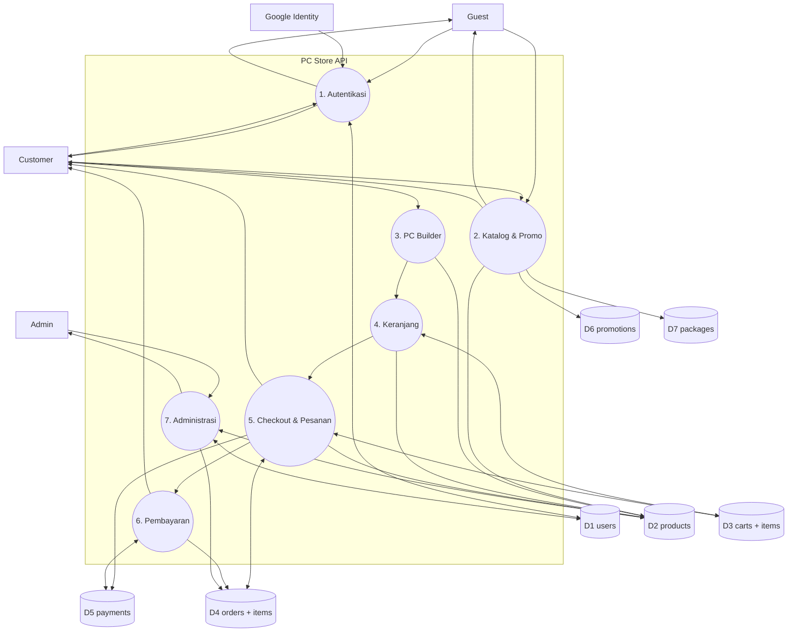

# DFD — PC Store API (acuan Frontend)

Sistem: **PC Store API** (`backend/`, base URL `http://127.0.0.1:8000/api`).
Auth: Bearer token (`Authorization: Bearer <token>`), kecuali endpoint publik.

## Level 0 — Diagram Konteks

## Level 1 — Rincian Proses

## Aliran data per proses (endpoint)

### 1. Autentikasi → D1 users
| Aliran | Endpoint | Keterangan |
|---|---|---|
| Registrasi | `POST /register` | `{name,email,password,phone}` → user + token. Role dikunci customer |
| Login | `POST /login` | `{email,password}` → user + token (rotate, 30 hari) |
| Login Google | `POST /login/google` | `{id_token}` GIS → user + token, email auto-verified |
| Profil / logout | `GET /me`, `POST /logout` | Butuh token |
| Lupa password | `POST /forgot-password` → `POST /reset-password` | Token 1 jam (debug: tampil di response) |
| Verifikasi email | `POST /verify-email`, `POST /resend-verification` | Wajib sebelum checkout user terdaftar |

### 2. Katalog & Promo (publik) → D2/D6/D7
`GET /products (?category,brand,q,socket,ram_type,sort)`, `GET /products/{id}`,
`GET /packages`, `GET /packages/{id}`, `GET /promotions` (hanya yang aktif).
Beli paket: `POST /api/packages/{id}/add-to-cart` → masuk cart sebagai `package_builds` (grup `build_id`).
Item produk membawa: `_id, category, brand, name, price, discount_price (harga jual), stock, image (URL), specs`.

### 3. PC Builder → D2, lanjut ke P4
`POST /builder/validate` `{cpu_id, motherboard_id, ram_id, storage_id, gpu_id, case_id, psu_id}`
→ `{is_compatible, errors[], warnings[], total_price, power_analysis}`.
`POST /builder/add-to-cart` — sama + `user_id`/`session_id`; 422 bila tidak kompatibel/stok habis.

### 4. Keranjang ↔ D3 (+D2 harga/stok)
`GET /cart`, `POST /cart/items {product_id,qty,source_type}`, `DELETE /cart/items/{id}`, `POST /cart/clear`.
Identitas: `user_id` (wajib token milik sendiri) atau `session_id` (guest).
Response `show` memisahkan `catalog_items` dan `builder_builds` (grup `build_id`).

### 5. Checkout & Pesanan ↔ D3/D4/D5/D2
`POST /orders/checkout {user_id|session_id, shipping_address, shipping_fee?}`
→ validasi stok + refresh harga → `Order(pending)` + `OrderItem` snapshot + `Payment(pending)` → cart dikosongkan + stok dikurangi.
`GET /orders` (milik sendiri; admin semua), `GET /orders/{id}` (pemilik/admin),
`POST /orders/{id}/cancel` (pemilik, pending saja), `PATCH /orders/{id}/status` (admin).
Status: `pending → processing → shipped → delivered`, atau `cancelled`.

### 6. Pembayaran ↔ D5/D4
`POST /payments/{orderId}/pay` (pemilik/admin, simulasi) → payment `paid`, order `processing`.

### 7. Administrasi (Bearer + admin)
CRUD produk (`POST/PUT/DELETE /products`), CRUD paket (`POST/PUT/DELETE /packages`),
CRUD promo (`POST/PUT/DELETE /promotions`), `GET /users`, `PATCH /users/{id}/role`,
`PATCH /orders/{id}/status`, `GET /admin/stats` (ringkasan user/produk/order/omzet/stok menipis).

## Catatan untuk Frontend
- Harga jual = `discount_price > 0 ? discount_price : price`.
- Gambar = `product.image` (URL langsung ke ``).
- Guest checkout didukung via `session_id`; user login wajib verifikasi email dulu.
- Simpan `token` + `user.role` setelah login untuk routing dashboard admin/user.
